# Commenting on Graphs

Comment-system allows user to comment on different graph components similar to add comments as a means to discuss or share ideas with their collaborators for a given graph, analogous to the way "Comments" on Google Docs allow users to discuss ideas on text documents.
. [GraphSpace](http://www.graphspace.org) allows users to comment on the following:

1. **Node** - Users can comment on a node.
2. **Edge** - Users can comment on an edge.
3. **Subgraph** - Users can comment on a combination of nodes and edges (a subgraph).

## Adding comments

Every graph has a tab named `Graph Visualization`, on opening this tab we can see a side panel on the right side of the graph. To add a comment we have to click on the `comments` button.

On clicking this button, you will see a `Add Comment` we have to click on it then the user will be redirected to a separate panel consisting of a `Comment box` where the user can select the part of the graph he/she wants to comment on and type the comment message in the space provided and click on the `Submit` button to create a comment.

The gif below shows an example of `Adding a new comment` to the graph.
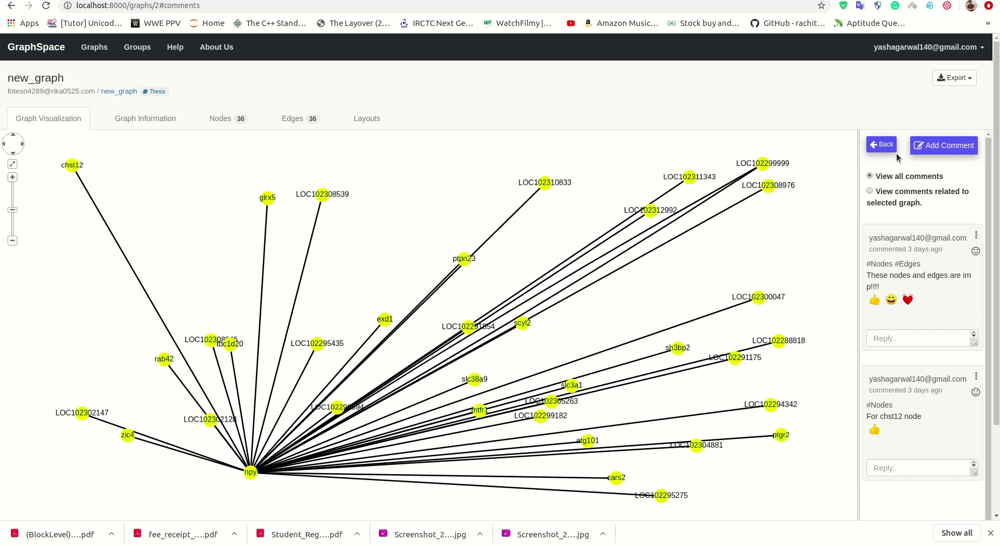

**Permissions**
1) Any user having permission to access the graph can add a comment on the graph.
2) User must have an account to comment on a graph (User must be signed in).

## Viewing comments

1) Every graph has a tab named `Graph Visualization`, on opening this tab we can see a side panel on the right side of the graph.
3) To view the comment we have to click on the `comments` button as shown in the image.

On clicking this button, the user will be redirected to a separate panel where all the comments under the graph are listed down.

The gif below shows an example of `Viewing comments` of a graph.
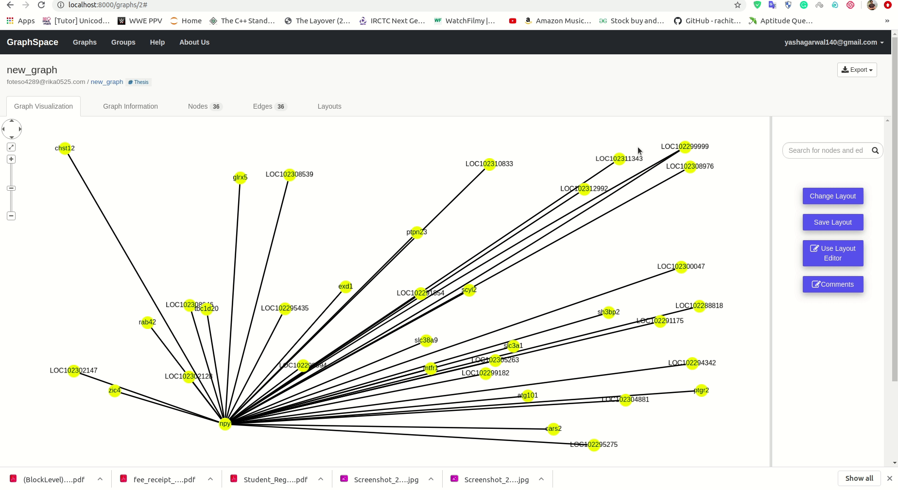

**Permissions**
1) Any user having permission to access the graph can view comments of that graph.

## Replying to comments

1) For replying to a specific comment user has to click on the space provided below for a `Comment` showing `Reply..`.
2) Then the user has to enter the reply message and click on the `Reply` button. The user has to click on `Cancel` button if he/she wants to discard the reply.

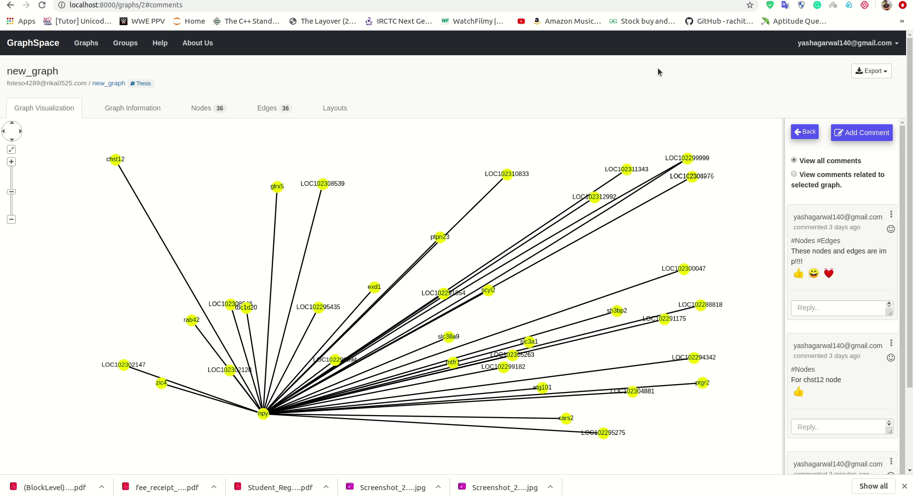

**Permissions**
1) Any user having permission to access the graph can add a comment on the graph.
2) User must have an account to comment on a graph (User must be signed in).

## Real-time experience of add and reply to comments

Since comment-system provides real-time experience using `Web-sockets` the following gifs demonstrate the real-time functionality of adding comments and replying to comments.

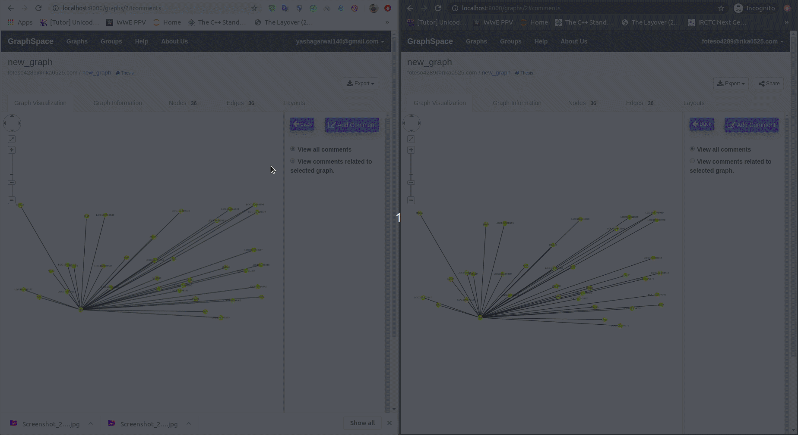

## Editing comments

User can edit comment messages by clicking on the `icon` present in the top-right corner of the comment box and clicking on `Edit` option. After that the user can enter the new message and click on `Edit` button to update the comment message.

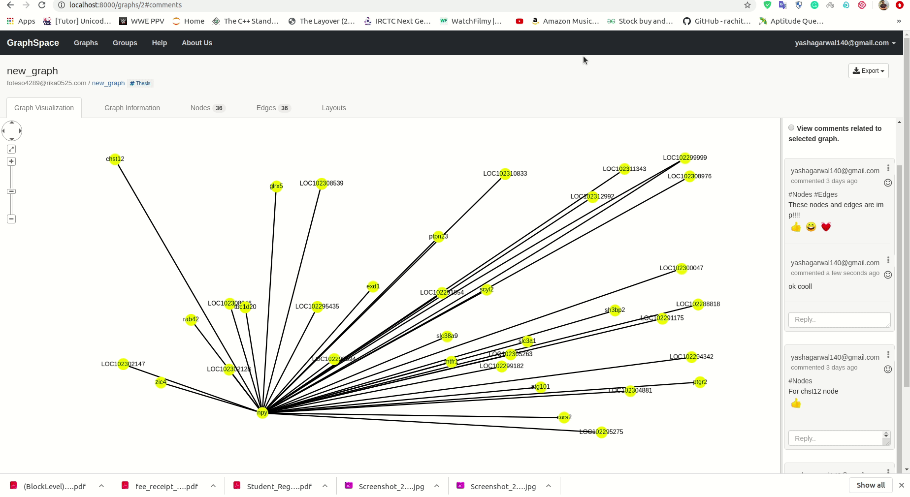

**Permissions**
1)  Only the creator of the comment can edit the comment message.

## Resolving comments

1) User can resolve comments by clicking on the `icon` present in the top-right corner of the comment box and clicking on `Resolve` option. After that the comments would be resolved and replies to that comment are **disabled**.
2) Only the **top most** comment in a comment thread can be resolved and the other comments in the thread(replies to top most comment) cannot be resolved.

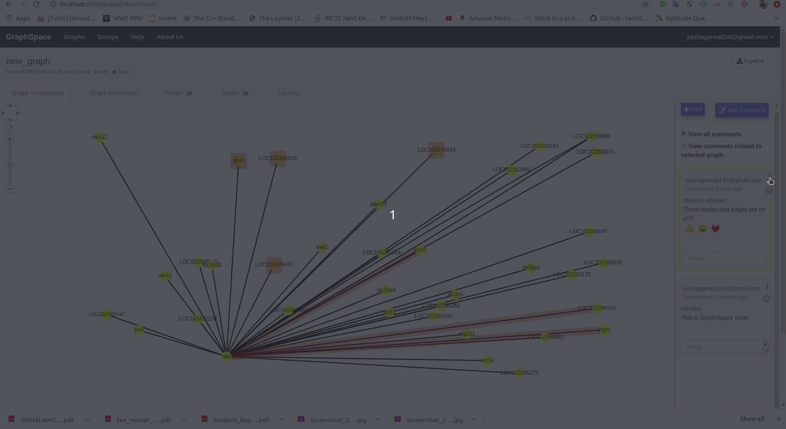

**Permissions**
1)  Only the creator of the comment can resolve the comment.

## Deleting comments

1) User can delete comments/replies by clicking on the `icon` present in the top-right corner of the comment/reply box and clicking on `Delete` option.
2) After a `Delete operation` the comment/reply will be **permanently lost** and cannot be retrieved.

**Permissions**
1)  Only the creator of the comment/reply can delete the comment/reply.

## Re-opening resolved comments

1) User can re-open comments by clicking on the icon present in the top-right corner of the comment box and clicking on `Re-open` option.
2) Only the **resolved comments** can be re-opened and replies are again allowed on re-opened comments.

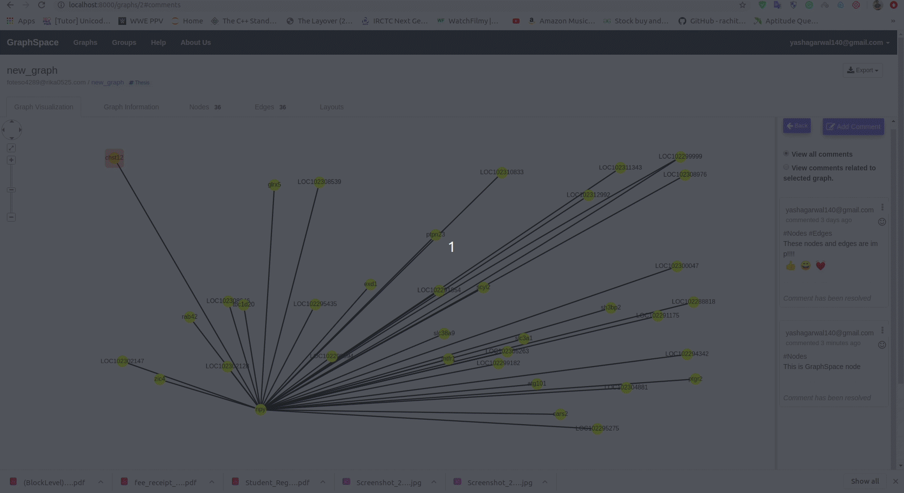

**Permissions**
1) Any user having permission to access the graph can re-open a comment.

## Real-time experience of edit resolve reopen and delete comments

All the real-time functionality involving editing, resolving, deleting and re-opening the comments is demonstrated in the gif below.

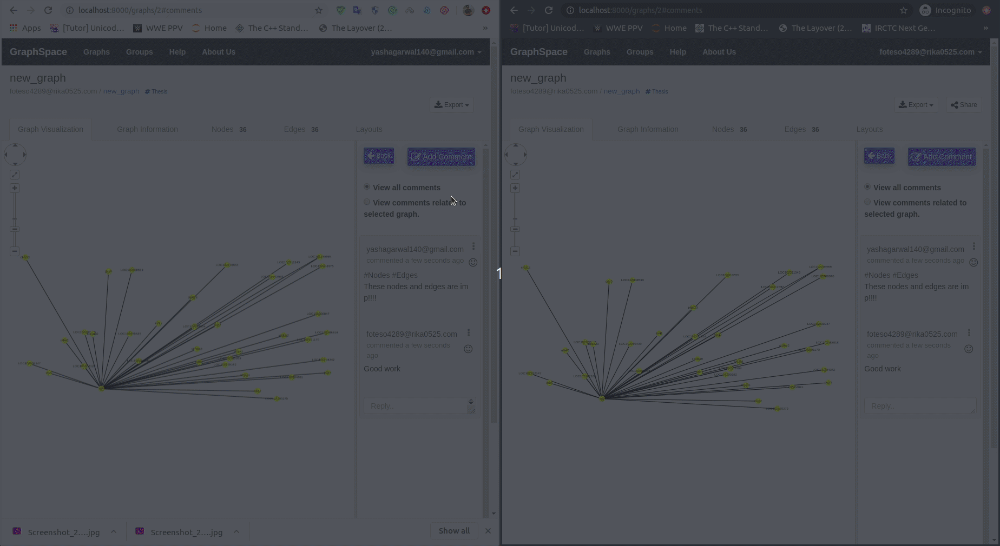

## Displaying comments associated with selected graph

1) User has the ability to filter comments to view only the comments related to a graph by clicking on the radio button `View comments related to selected graph`.
2) User has to select the part of the graph on which he wishes to view the comments and the comments related to that part of the graph are listed down.

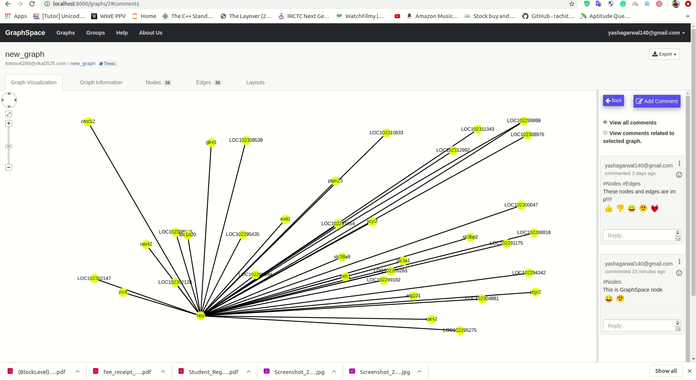

**Permissions**
1) Any user having permission to access the graph can use this feature. 
2) User must have an account to access this feature. (User must be signed in).

## Highlighting subgraph associated with a comment

1) User can view the part of the graph a comment is associated with, this can be done by `hovering` over a comment box.
2) On hovering over a comment the part of the graph related to that comment is **highlighted**.

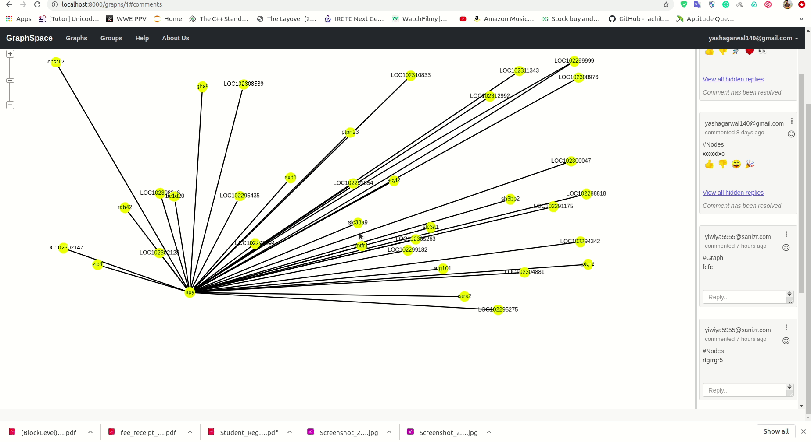

## React unreact to the comments and replies

User can react unreact comment messages by clicking on the `emoji icon` present in the top-right corner of the comment box and clicking on `Emoji`. After that if user want to unreact then clicking on the same emoji again from the emoji icon in the top-right corner .

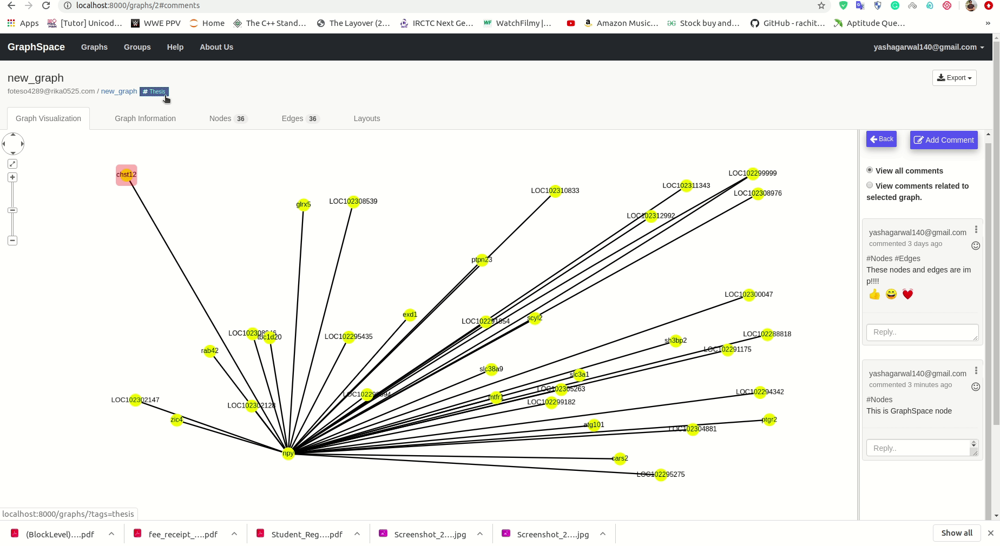

**Permissions**
1) Any user having permission to access the graph can use this feature. 
2) User must have an account to access this feature. (User must be signed in).