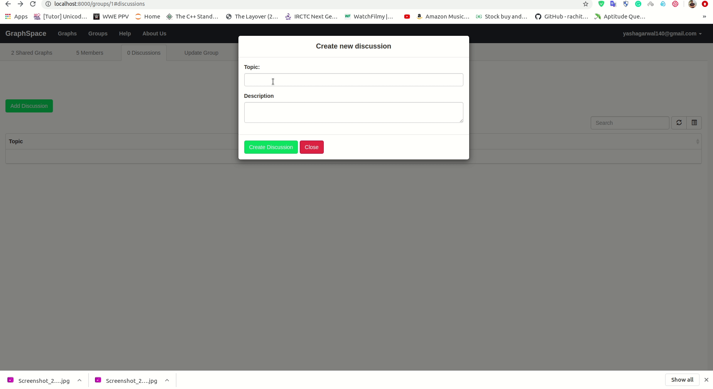
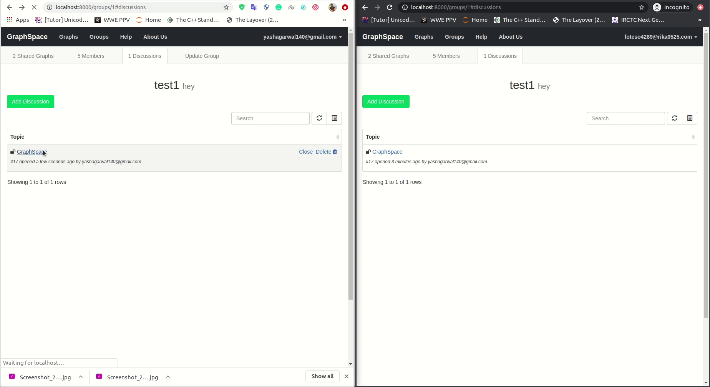
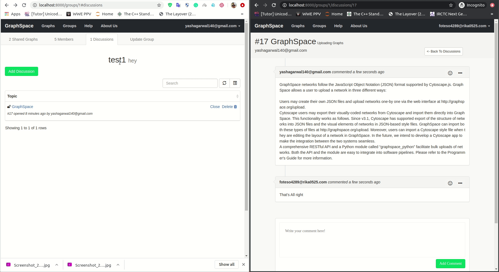
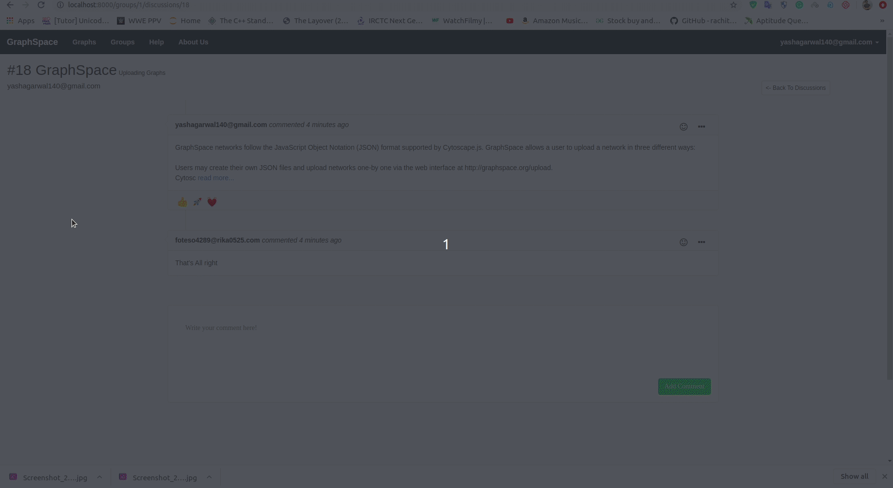

# Group Discussions

## Description

This is the feature of [Graphspace](http://www.graphspace.org) is used for discussions inside the group. This feature allows users to create discussions about some particular topic so that members of the group will join the discussions and discuss the topic. This feature helps researchers to discuss about some ideas and issues.

## Create Discussion

The user can create a discussion inside the group by following the given steps:

1. Before creating discussions,the user must be a member of the group and logged in.
2. Click on the `Discussion` tab inside the group. This will open a discussion table with a Add Discussion button.
3. Click on the `Add Discussion` button and this will trigger a pop-up form for creating discussion.
4. Fill out the topic and description of your discussion which you want to discuss.
5. Click on the `Create Discussion` button to create discussion.
5. Your discussion is created and it is visible in the discussion table in the discussions tab.

## Discussion Table

After your discussion is created it is visible on the discussion table, from there you can delete, close, re-open discussion by follwing steps:

1. You can see your discussion on the top of discussion table where you can see delete and close discussion options if you are the owner of the discussion, other members of the group can see discussions but don't have control over it.
2. For deleting discussion you click on `delete` and this will trigger the pop-up for delete discussion.
3. Click on `Delete` this will delete you discussion.
4. If your discussion is completed you can close the discussion by clicking on `Close` so that no can further comment and edit.
5. If you want to re-open the discussion you can do that by clicking on `re-open` so that users can again comment and edit.

Since the discussion system is real-time so you don't have to worry about what will be the response of users pages with your changes.

## Searching and Filter Discussions

Searching discussions is feature that enables you to search discussion based on your input.

1. On the top of discussion table there is a search box where you have to give some input and it will filter the discussions based on your keyword.
2. The following elements will be used for searching discussions:
    1. `Owner email`
    2. `Discussion Topic`
    3. `Discussion Description`

## Discussion Comments

Group members can view the discussion and comment by the following steps:

1. Click on the discussion from the discussion table and this will redirect you to that discussion page.
2. If the discussion is closed then you can't comment on it.
3. If the discussion is open you can see the comment box below discussions there you can write your comment and click on `Create Comment` button.
4. Your comment is created and now you can edit or delete the comment from the menu dropdown by clicking on `edit` and `delete` options.
5. If you want to go back to discussion table click on `Back to Discussion` button.

## Comment Reactions

Group members can react on comments by the following steps:

1. Click on the smiley emoticon on top-right of the comment and this will open the dropdown and you can see a list of emoticons.
2. Choose the reaction from the list and click on it, this will react on comments.
3. For Unreact you can again click on the same emoji so that you can unreact.
4. On hover on the reaction you will see the list of users reacted that reaction on the same particular comment.

